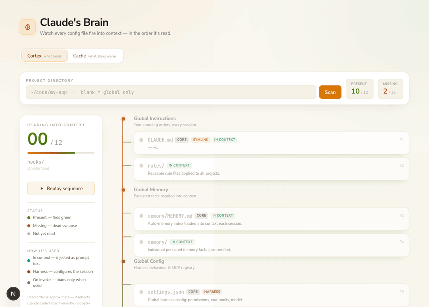

# 🧠 Claude's Brain

**The Cortex** — watch every file Claude Code reads *fire into context in the order it's loaded*, then click any one to view and edit it. A local-only Next.js dashboard that scans your filesystem and animates the full config hierarchy as a neural cascade: present files flash green and hold a synaptic glow, missing files flash red and stay dark (a dead synapse).




## Why

Claude Code loads context from a sprawl of files across `~/.claude/`, `~/.claude.json` and per-project `.claude/` directories. It's hard to know what's actually in play — and in what order. This gives you a single animated screen: a vertical "cortex" spine carries a traveling pulse down through ordered strata (global → project → on-demand), lighting each file as it's read.

The app has two tabs:
- **Cortex** — the file map below.
- **Cache** — an interactive, faithful model of Anthropic **prompt caching**, taught through one-click **scenarios**. Pick *Rapid back-and-forth*, *Coffee break*, *Edit your system prompt*, or *Switch models* and press **▶ Play**: a tools→system→messages prefix bar (warm = sage, cold = terracotta), a TTL clock (5-min), a **timeline** with a moving playhead (wait segments show the green→red split right at the TTL boundary), and a narrated **event log** all react live while a cost ledger tallies spend vs. no-cache. The cost math lives in `lib/cache-model.ts` (unit-tested).

## The visualization

- **Read-order sweep** — files fire one-by-one in load sequence; the left rail counts `07 / 23` and names the file currently being read.
- **Present 🟢 / Missing 🔴** — present files pulse green; missing core files raise a banner; on-demand extensions (commands/agents/skills/hooks) reveal last, set apart since they only load when invoked.
- **How each file is used** — every node is tagged by *mechanism*, an axis orthogonal to scope: **in context** (injected into the prompt as text — `CLAUDE.md`, `AGENTS.md`, `MEMORY.md`, `rules/`), **harness** (configures permissions/hooks/env/MCP, *not* prompt text — `settings.json`, `.mcp.json`, `keybindings.json`, `~/.claude.json`), or **on invoke** (discovered now, content loads only when used — `commands/`, `agents/`, `skills/`, `hooks/`). The firing readout adapts its verb to match ("Reading into context" vs "Configuring harness" vs "Registering").
- **Click to view, edit & create** — click any node to open its contents in a modal and **save real edits to disk**. Missing files can be *created* (e.g. a `CLAUDE.local.md`); open a directory and use **"+ New file in this folder"** to create a brand-new rule / command / subagent / memory file. Editing a symlink (like global `CLAUDE.md`) warns that it writes through to the real target. Writes are confined to Claude's own config by an allowlist — it physically cannot touch anything outside `~/.claude` or the active project's tracked paths.
- **Detail per node** — symlink targets, sizes, mtimes, directory item counts, `core` tags.
- **Replay** any time; respects `prefers-reduced-motion` (renders the full map instantly).
- Built with **framer-motion** (`motion`) and Tailwind v4, in a warm "paper" aesthetic — cream surface, amber accent, **Fredoka** display / **Nunito Sans** body / **JetBrains Mono** for data.

> Read order is approximate — it reflects Claude Code's documented load hierarchy, not byte-exact timing.

## What it tracks

**Global (`~/.claude/`)**
- `CLAUDE.md` (global instructions) · `memory/MEMORY.md` + `memory/` · `settings.json` · `settings.local.json` · `keybindings.json`
- `rules/` · `agents/` · `commands/` · `skills/` · `hooks/`
- `~/.claude.json` (home-level MCP server registry)

**Project (`<project>/`)**
- `CLAUDE.md` · `CLAUDE.local.md` · `AGENTS.md`
- `.claude/settings.json` · `.claude/settings.local.json` · `.mcp.json`
- `.claude/rules/` · `.claude/agents/` · `.claude/commands/` · `.claude/skills/` · `.claude/hooks/`

The full catalog lives in [`lib/catalog.ts`](lib/catalog.ts) — add or edit entries there.

## Run it

**One-time setup** — make `claude-brain` available from any terminal:

```bash
npm install
npm link          # registers the global `claude-brain` command
```

**Every time after** — from anywhere:

```bash
claude-brain      # builds once on first run, then starts instantly + opens your browser
```

It auto-picks a free port and opens the tab for you. `Ctrl-C` to stop.

```
claude-brain --no-open     # just print the URL, don't open a browser
claude-brain --port 4317   # use a specific port
claude-brain --rebuild     # force a fresh production build
```

Prefer not to install globally? `npx . ` from the repo, or `npm run launch`. The old `npm run dev` still works for development with hot-reload.

In the app: leave the project field blank to map **global only**, or pick a project from the quick-chips (auto-populated from `~/code`) / type any path (`~` is expanded) to add the **project** scope.

## How it works

- `lib/catalog.ts` — the canonical map of paths Claude Code reads, each tagged with `tier`, `loadType` (`startup` / `on-demand`) and a read `order`. **Single source of truth** — add a `CatalogEntry` here and the scanner + cortex pick it up automatically.
- `lib/scan.ts` — `lstat`/`stat`/`readlink` each entry: existence, symlink target, size, mtime, directory child counts.
- `lib/file-access.ts` — the editor's security boundary: `checkAccess` permits a path only if it's a tracked file or inside a tracked dir (resolved + traversal-checked).
- `app/api/scan/route.ts` — resolves a project path and runs the scanner (Node runtime).
- `app/api/file/route.ts` — `GET` reads a file / lists a dir; `PUT` writes to disk. Both gated by `checkAccess`.
- `app/components/file-modal.tsx` — the click-to-edit modal.
- `app/api/projects/route.ts` — lists `~/code` subdirectories for the quick-pick chips.
- `app/components/cortex.tsx` — the animated neural visualization (framer-motion sequencing engine).
- `app/page.tsx` — header, project picker, stats; renders the Cortex.

Nothing is sent or deployed. It reads your local disk and renders in the browser; the only writes are edits you explicitly save through the modal, and only to Claude's own config files (enforced by `lib/file-access.ts`).

## Stack

Next.js 16 · React 19 · Tailwind CSS v4 · framer-motion (`motion`) · TypeScript. Local-first by design (needs filesystem access, so it is **not** meant for Vercel hosting).

## Contributing

Contributions are welcome! Please open an issue first to discuss what you'd like to change.

1. Fork the repo
2. Create a feature branch (`git checkout -b feature/your-feature`)
3. Commit your changes (`git commit -m 'feat: describe change'`)
4. Push and open a pull request

Please make sure tests and `npm run lint` pass before submitting a PR.

## Code of Conduct

This project follows the [Contributor Covenant v2.1](https://www.contributor-covenant.org/version/2/1/code_of_conduct/).
By participating you agree to uphold a welcoming, harassment-free environment.

## License

Distributed under the MIT License. See [LICENSE](LICENSE) for details.
